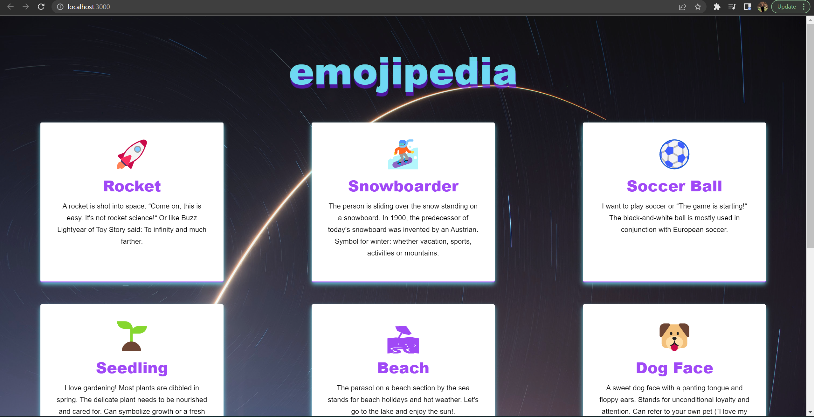
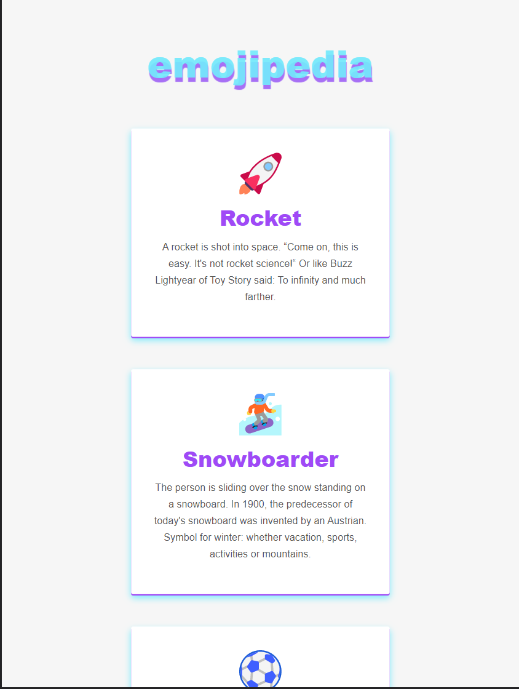
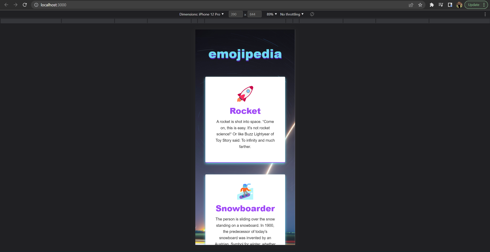
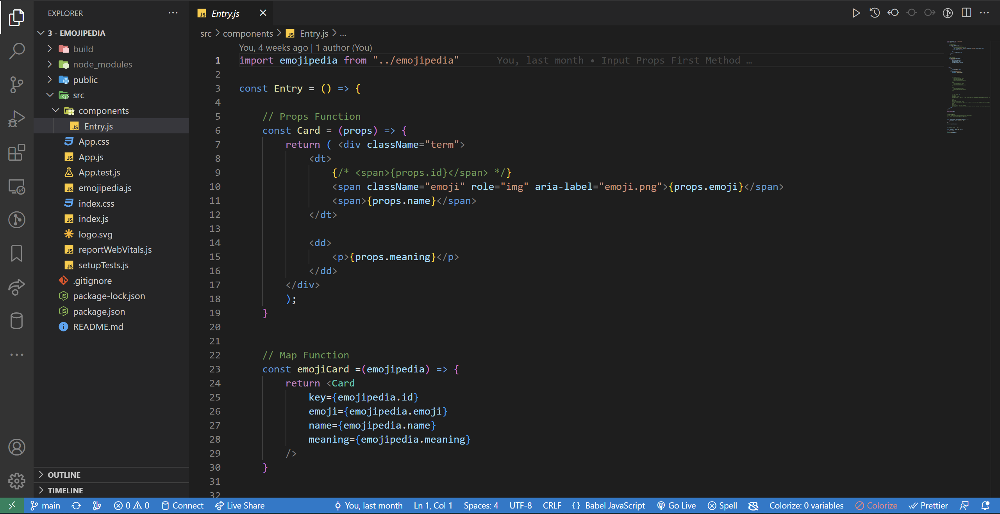

<!-- markdownlint-configure-file {
  "MD013": {
    "code_blocks": false,
    "tables": false
  },
  "MD033": false,
  "MD041": false
} -->

  

# Emojipedia

This is the Emojipedia Project by Udemy - Web Development Bootcamp 2022

It is made with React JS utilizing the Props Feature. Emojipedia Cards: Rocket,
Snowboarder, Soccer Ball, Seeding, Beach, Dog Face, Avocado, Flat pan with Food 
& Laptop

Emojipedia Project - Udemy - Web Development Bootcamp 2022

## Website

🖥️ [https://emojipedia-by-johncanero.vercel.app/]

✍️ Project by John Cañero

## Responsive Design

🪟: [Desktop - Tablet - Mobile]

